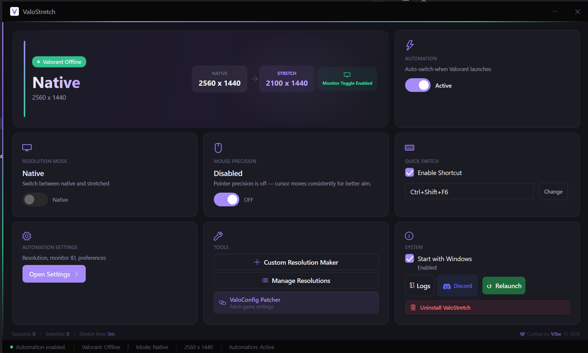
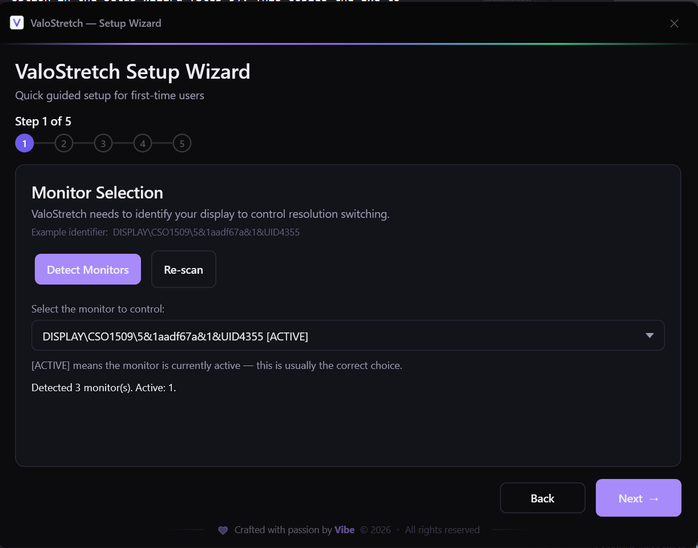
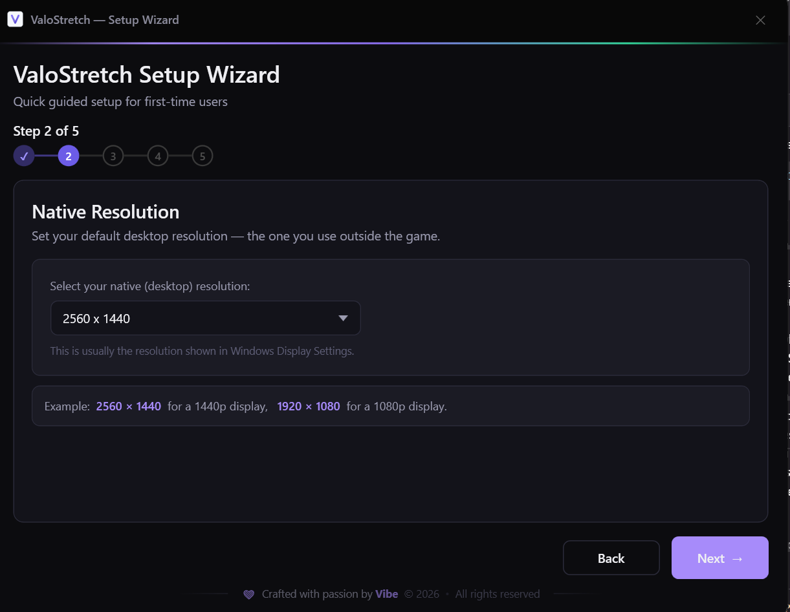
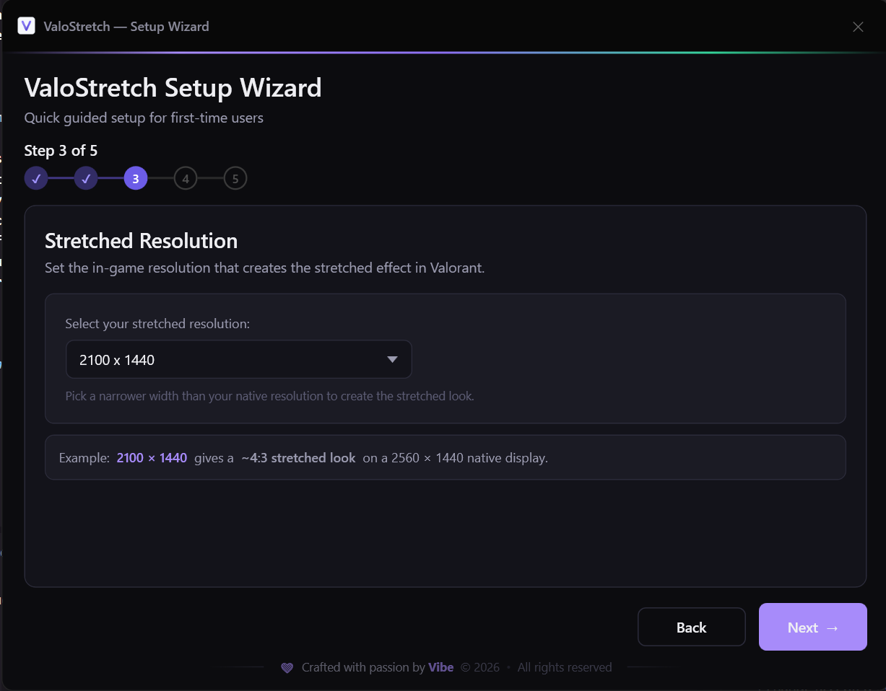
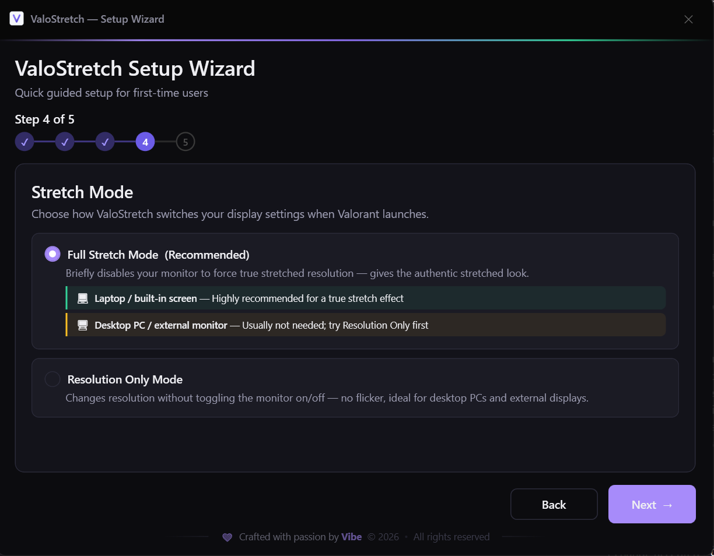
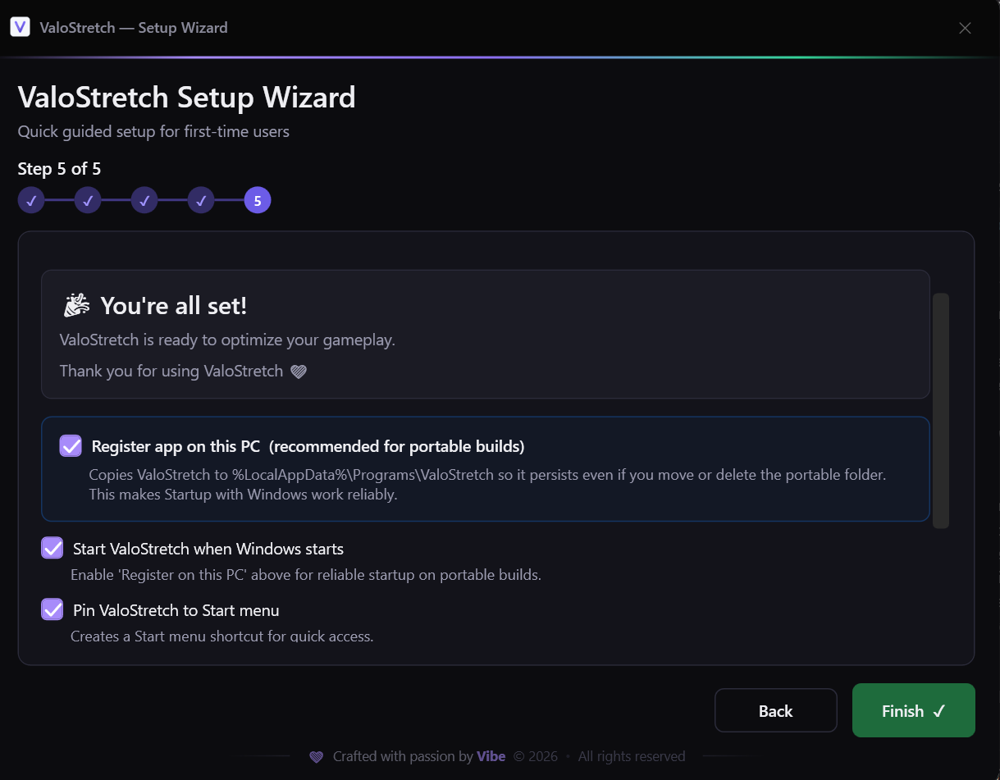
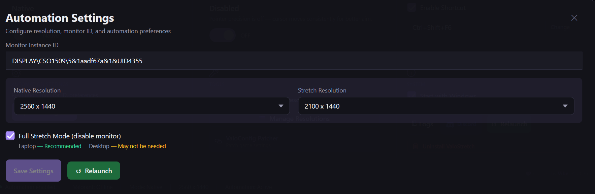
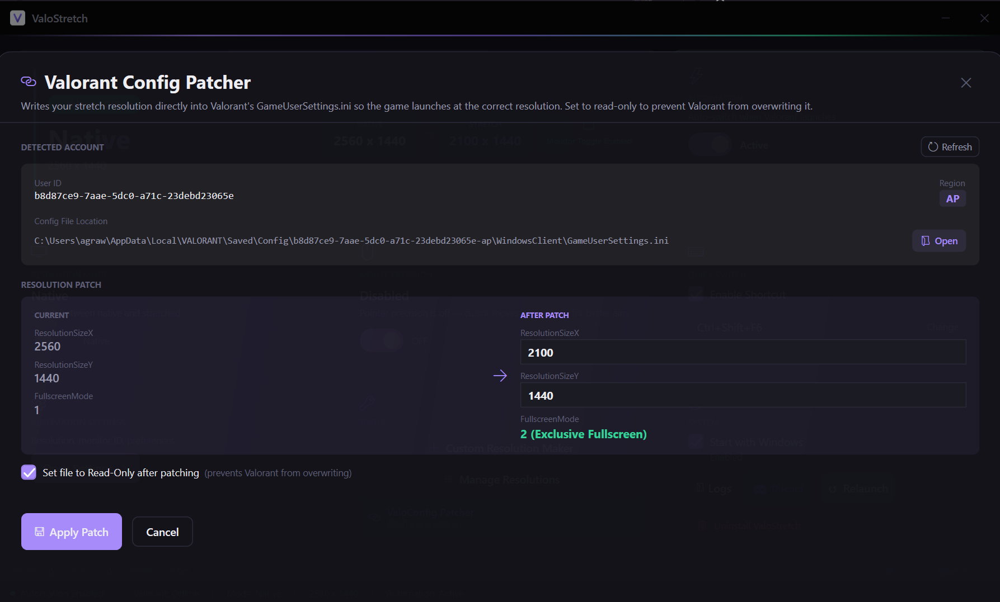
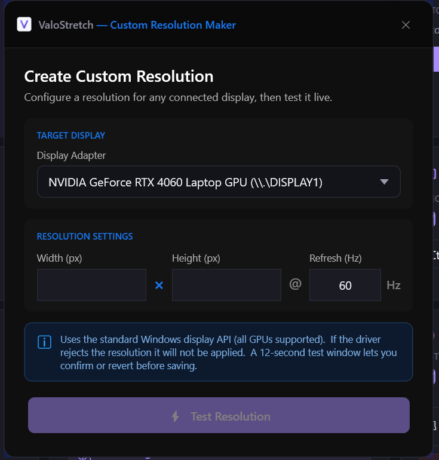
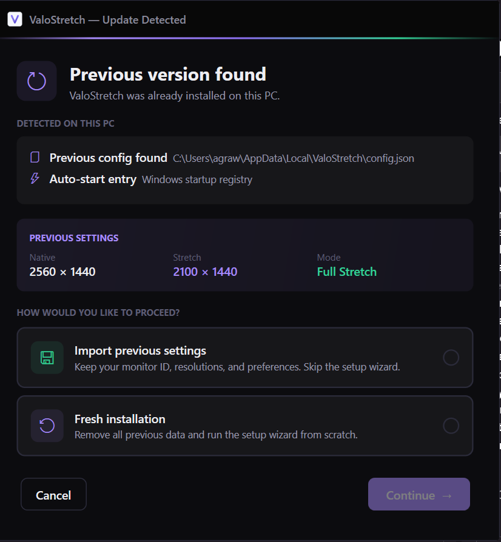

<div align="center">



# ValoStretch

**Automatic stretched resolution switching for Valorant — runs silently in your system tray**

[](https://github.com/YOUR_USERNAME/ValoStretch/releases/latest)
[](https://github.com/YOUR_USERNAME/ValoStretch/releases/latest)
[](https://github.com/YOUR_USERNAME/ValoStretch/releases/latest)
[](https://discord.gg/uA3sMpFAuG)

[**⬇ Download Latest**](https://github.com/YOUR_USERNAME/ValoStretch/releases/latest) · [**📋 Changelog**](CHANGELOG.md) · [**🐛 Report Bug**](https://github.com/YOUR_USERNAME/ValoStretch/issues/new?template=bug_report.md) · [**💡 Request Feature**](https://github.com/YOUR_USERNAME/ValoStretch/issues/new?template=feature_request.md)

</div>

---

## What is ValoStretch?

ValoStretch is a free Windows tool that **automatically switches your monitor to a stretched resolution when Valorant launches**, and restores your native resolution when you close the game.

No more manually changing display settings before every game. No more forgetting to switch back. It just works — silently, in the background, using near-zero CPU and RAM.

> **Portable** — single `.exe` file, no installer, no admin rights needed for basic use.  
> **Free** — always has been, always will be.

---

## Features

| Feature | Description |
|---------|-------------|
| 🔄 **Auto-Switch** | Detects Valorant launch/close and switches resolution automatically |
| 🖥 **Full Stretch Mode** | Briefly disables monitor to force true stretched resolution (recommended for laptops) |
| 📐 **Resolution Only Mode** | Changes resolution without monitor toggle — no flicker (ideal for desktops) |
| ⌨ **Global Hotkey** | Press `Ctrl+Shift+F6` anytime to manually toggle stretch/native |
| 🎮 **ValoConfig Patcher** | Writes stretch resolution directly into Valorant's `GameUserSettings.ini` |
| 📊 **Custom Resolution Maker** | Create and inject custom resolutions via NVAPI (NVIDIA GPUs) |
| 📈 **Usage Stats** | Tracks sessions, switches, and total stretch time |
| 🔔 **System Tray** | Lives in your tray — right-click for quick controls |
| 🚀 **Start with Windows** | Auto-starts minimized so it's always ready |
| ♻ **Smart Upgrade** | Detects previous versions and handles migration automatically |

---

## Screenshots

<details>
<summary><b>Main Window</b></summary>
<br>

</details>

<details>
<summary><b>Setup Wizard — Step 1: Monitor Selection</b></summary>
<br>

</details>

<details>
<summary><b>Setup Wizard — Step 2: Native Resolution</b></summary>
<br>

</details>

<details>
<summary><b>Setup Wizard — Step 3: Stretch Resolution</b></summary>
<br>

</details>

<details>
<summary><b>Setup Wizard — Step 4: Stretch Mode</b></summary>
<br>

</details>

<details>
<summary><b>Setup Wizard — Step 5: Startup & Registration</b></summary>
<br>

</details>

<details>
<summary><b>Automation Settings</b></summary>
<br>

</details>

<details>
<summary><b>Valorant Config Patcher</b></summary>
<br>

</details>

<details>
<summary><b>Custom Resolution Maker</b></summary>
<br>

</details>

<details>
<summary><b>Update Detection (upgrading from v1)</b></summary>
<br>

</details>

---

## Download & Install

### Fresh Install

1. Go to [**Releases**](https://github.com/YOUR_USERNAME/ValoStretch/releases/latest)
2. Download `ValoStretch.exe`
3. Run it — the setup wizard opens automatically
4. Follow the 5 steps (takes about 2 minutes)
5. Done — ValoStretch is running in your tray

> No installation required. Place the exe anywhere you want.

### Upgrading from v1

Just run the new `ValoStretch.exe`. It will automatically detect your previous installation and ask whether to:
- **Import your settings** — keeps your monitor ID, resolutions, and preferences. No re-setup needed.
- **Fresh install** — wipes old data and runs the setup wizard from scratch.

Your auto-start entry is automatically updated to point to the new exe.

---

## Setup Guide

### Step 1 — Monitor Selection
ValoStretch needs to know which monitor to control. Click **Detect Monitors** and select your display from the dropdown. The one marked `[ACTIVE]` is usually correct.

### Step 2 — Native Resolution
Set your normal desktop resolution (the one you use outside Valorant). Example: `2560 × 1440` for a 1440p display.

### Step 3 — Stretch Resolution
Set the resolution you want in Valorant. Example: `2100 × 1440` gives a ~4:3 stretched look on a 1440p display.

### Step 4 — Stretch Mode
Choose how the switch happens:

| Mode | Best For | How It Works |
|------|----------|-------------|
| **Full Stretch Mode** | Laptops / built-in screens | Briefly disables monitor to force true stretch |
| **Resolution Only** | Desktop PCs / external monitors | Changes resolution without monitor toggle |

### Step 5 — Startup Options
- **Register on this PC** — copies the exe to `%LocalAppData%\Programs\ValoStretch\` so it persists if you move the original file. Required for reliable auto-start.
- **Start with Windows** — launches ValoStretch minimized on every boot.
- **Pin to Start menu** — creates a Start menu shortcut.

---

## How It Works

```
Valorant launches
      ↓
ValoStretch detects the process (via WMI events)
      ↓
Switches display to stretch resolution
      ↓
You play Valorant in stretched
      ↓
Valorant closes
      ↓
ValoStretch restores native resolution automatically
```

The app uses **WMI process events** (zero polling overhead) to detect Valorant. When WMI is unavailable, it falls back to 3-second polling. A watchdog checks every 8 seconds that the resolution hasn't drifted (Valorant's anti-cheat can reset it).

---

## ValoConfig Patcher

The ValoConfig Patcher writes your stretch resolution directly into Valorant's `GameUserSettings.ini` file so the game itself requests the correct resolution on launch.

**How to use:**
1. Open ValoStretch → Tools → **ValoConfig Patcher**
2. Your Valorant account is detected automatically
3. Review the current vs. after-patch values
4. Click **Apply Patch**
5. The file is saved as read-only to prevent Valorant from overwriting it

> Requires Valorant to have been launched at least once so the config file exists.

---

## Custom Resolution Maker

For NVIDIA GPU users — create custom resolutions that aren't in Windows' default list.

1. Open ValoStretch → Tools → **Custom Resolution Maker**
2. Select your display adapter
3. Enter width, height, and refresh rate
4. Click **Test Resolution** — a 12-second preview lets you confirm before saving
5. The resolution is injected via NVAPI and added to your available resolutions list

---

## Hotkey

The global hotkey `Ctrl+Shift+F6` toggles between native and stretched resolution at any time — even when ValoStretch is minimized to tray.

To change it: open ValoStretch → **Quick Switch** tile → click **Change** → press your desired key combination.

---

## System Requirements

| Requirement | Details |
|-------------|---------|
| **OS** | Windows 10 or Windows 11 (64-bit) |
| **Runtime** | None — fully self-contained |
| **GPU** | Any (Custom Resolution Maker requires NVIDIA) |
| **Valorant** | Must be installed and launched at least once |
| **Disk** | ~75 MB (single exe) |
| **RAM** | ~30–50 MB at idle |
| **CPU** | Negligible — event-driven, not polling-based |

---

## Troubleshooting

**Resolution doesn't switch when Valorant launches**
- Make sure automation is enabled (toggle in the main window)
- Check that the correct monitor is selected in Automation Settings
- Try switching to Resolution Only mode if Full Stretch Mode causes issues

**App doesn't start with Windows after moving the exe**
- Open ValoStretch → Automation Settings → Save Settings
- Or run the setup wizard again and enable "Register on this PC"

**ValoConfig Patcher says "config not found"**
- Launch Valorant and play at least one game, then try again
- Make sure you're logged into your Riot account

**Custom resolutions not showing in Valorant**
- NVIDIA GPU required for NVAPI injection
- Try restarting your PC after creating a custom resolution
- Vanguard may require a reboot after NVAPI changes

**Old version keeps starting after upgrade**
- Run the new `ValoStretch.exe` — it will detect the old version and fix the auto-start entry automatically

---

## Privacy

ValoStretch does not:
- Connect to the internet
- Collect any data
- Send telemetry
- Require an account

All data (config, logs, stats) is stored locally in `%LocalAppData%\ValoStretch\`.

---

## Uninstalling

Open ValoStretch → System tile → **Uninstall ValoStretch**

Type `uninstall` to confirm. The app will:
- Remove all config, logs, and stats
- Remove the auto-start entry
- Remove the Start menu shortcut
- Restore Valorant's config to native resolution
- Delete itself

---

## Changelog

See [**CHANGELOG.md**](CHANGELOG.md) for the full patch notes.

**Latest — v2.0**
- Smart upgrade system with migration dialog
- Rebuilt ValoConfig Patcher with correct path detection
- Hardware rendering restored (major smoothness improvement)
- System tray redesign with live stats
- First-launch onboarding overlay
- Resolution stats tracking
- Hotkey enabled by default with auto-restart on toggle
- Uninstall now fully cleans everything including Valorant config patch

---

## Support & Community

- **Bug reports** → [GitHub Issues](https://github.com/YOUR_USERNAME/ValoStretch/issues/new?template=bug_report.md)
- **Feature requests** → [GitHub Issues](https://github.com/YOUR_USERNAME/ValoStretch/issues/new?template=feature_request.md)
- **Discord** → [Join the server](https://discord.gg/uA3sMpFAuG)

---

## Disclaimer

ValoStretch is an independent tool not affiliated with Riot Games. It operates at the Windows display API level and does not modify game files or memory. Use at your own discretion.

---

<div align="center">

Made with 💜 by **Vibe** · © 2026

</div>
